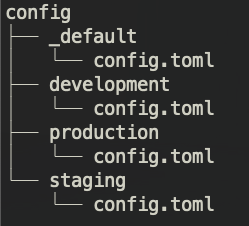

# Description

Composite action used to deploy a hugo blog to gcs

# Usage

The action works with the config structure used by hugo eg. 

See https://gohugo.io/getting-started/configuration/ for more information about hugo configuration

# Inputs

- deployment-target:
    - description: "target of hugo deploy command, [[deployment.targets]].name"
    - required: true
- deployment-environment:
    - description: "build environment, which hugo configuration in config/ to use"
    - required: true
-  gcp-project-id:
    - description: "google cloud project id, used to generate application credentials during runtime"
    - required: true
  - gcp-service-account-key:
    - description: "service account key used for uploading to gcs"
    - required: true
